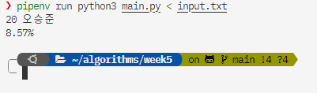
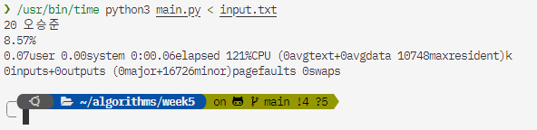

# Brute Force Algorithms Assignment Report

# 2019311801 이균서

\newpage

## Execution Environment

### OS

Distributor ID: Ubuntu  
Description: Ubuntu 22.04.3 LTS  
Release: 22.04  
Codename: jammy

### Python3 Runtime and Pipfile (pipenv)

Runtime Version: Python 3.11.6  
package manager and virtual environment: pipenv

package dependencies가 없는 것을 확실히 하기 위해 pipenv를 사용했습니다.

하기 `Pipfile`에 명시된 대로, denpendencies는 없습니다.

```
[[source]]
url = "https://pypi.org/simple"
verify_ssl = true
name = "pypi"

[packages]

[dev-packages]

[requires]
python_version = "3.11"
python_full_version = "3.11.6"
```

즉, 추가로 설치한 패키지는 없습니다.

\newpage

## Program Source Code

```python
# 2019311801 이균서
import sys
import csv
import re
from collections import defaultdict

print = sys.stdout.write
input = sys.stdin.readline

N, file_name = map(str, input().rstrip().split())
N = int(N)
try:
    fin = open(file_name, "r", encoding="utf-8")
except FileNotFoundError:
    print(f"{file_name} not found!\n")
    sys.exit(0)

csv_fin = csv.reader(fin)
data = []
user_dict = defaultdict(int)
msg_cnt = 0
for i, line in enumerate(csv_fin):
    if i == 0:
        continue
    msg_cnt += 1
    # if line[2] includes "ㅋ" more than 3 times sequentially, then add 1 to user_dict[line[1]]
    if re.search(r"ㅋ{3,}", line[2]):
        user_dict[line[1]] += 1

# print user who has the most high value of user_dict
max_value = max(user_dict.values())
for k, v in user_dict.items():
    if v == max_value:
        print(k + "\n")
# 백분율로 소수점 2번째 자리까지 출력
print(f"{max_value * 100 / msg_cnt:.2f}%\n")
fin.close()

```

\newpage

## Data and Input

### Data

- [KakaoTalk_Chat\_\_\_\_\_\_\_\_\_\_\_\_2023-10-04-17-06-34.csv](https://piazza.com/redirect/s3?bucket=uploads&prefix=paste%2Fllui864osim11d%2Fa26231d35f8801fe90835532bab37aa4b614caffbdbfc21faf1d83e534860f73%2FKakaoTalk_Chat____________2023-10-04-17-06-34.csv)

### Input

`input.txt`:

```txt
4 data.csv
```

\newpage

## Program Execution

### How to Execute

`data.csv`([KakaoTalk_Chat\_\_\_\_\_\_\_\_\_\_\_\_2023-10-04-17-06-34.csv](https://piazza.com/redirect/s3?bucket=uploads&prefix=paste%2Fllui864osim11d%2Fa26231d35f8801fe90835532bab37aa4b614caffbdbfc21faf1d83e534860f73%2FKakaoTalk_Chat____________2023-10-04-17-06-34.csv)) 파일과 `input.txt` file을 python file과 디렉토리에 위치시킨 후, 하기 명령어를 실행합니다.

### Program Execution Command

```zsh
python3 main.py < input.txt
```

실행 결과는 하기와 같습니다.

```zsh
20 오승준
8.57%
```

### Program Execution ScreenShot



### How to Measure Program Execution Time

`/usr/bin/time` binary를 이용하여 실행 시간을 측정합니다.

```zsh
/usr/bin/time python3 main.py < input.txt
```

실행 결과는 하기와 같습니다.

```zsh
20 오승준
8.57%
0.07user 0.00system 0:00.06elapsed 121%CPU (0avgtext+0avgdata 10748maxresident)k
0inputs+0outputs (0major+16726minor)pagefaults 0swaps
```

약 $0:00.06$가 소요되었습니다.

### Measured Program Execution Time ScreenShot


