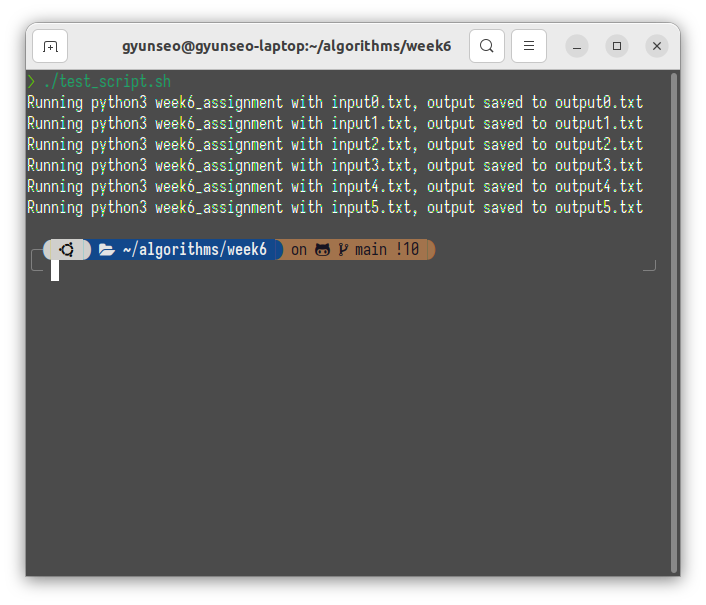

<!--
 Copyright 2023 gyunseo

 Licensed under the Apache License, Version 2.0 (the "License");
 you may not use this file except in compliance with the License.
 You may obtain a copy of the License at

     http://www.apache.org/licenses/LICENSE-2.0

 Unless required by applicable law or agreed to in writing, software
 distributed under the License is distributed on an "AS IS" BASIS,
 WITHOUT WARRANTIES OR CONDITIONS OF ANY KIND, either express or implied.
 See the License for the specific language governing permissions and
 limitations under the License.
-->

# Divide and Conquer Assignment Report

### 2019311801 이균서

## Execution Environment

### OS

Distributor ID: Ubuntu  
Description: Ubuntu 22.04.3 LTS  
Release: 22.04  
Codename: jammy

### Python3 Runtime and Pipfile (pipenv)

Runtime Version: Python 3.11.6  
package manager and virtual environment: pipenv

package dependencies가 없는 것을 확실히 하기 위해 pipenv를 사용했습니다.

하기 `Pipfile`에 명시된 대로, denpendencies는 없습니다.

```
[[source]]
url = "https://pypi.org/simple"
verify_ssl = true
name = "pypi"

[packages]

[dev-packages]

[requires]
python_version = "3.11"
python_full_version = "3.11.6"
```

즉, 추가로 설치한 패키지는 없습니다.

\newpage

## Program Source Code

```python
import sys, csv, random
from itertools import combinations, permutations, product, combinations_with_replacement
input = sys.stdin.readline
print = sys.stdout.write
sex_dict = {"남": 0, "여": 1}
user_sex_str = input().rstrip()
user_sex = sex_dict[user_sex_str]
user_goal_str = input().rstrip()
goal_dict = {"체중감량": 0, "근육증가": 1, "건강유지": 2}
user_goal = goal_dict[user_goal_str]
try:
    fin = open("data.csv", "r", encoding="utf-8")
except FileNotFoundError:
    print("data.csv not found!\n")
    sys.exit(0)
csv_fin = csv.reader(fin)
유산소 = []
근력_운동 = []
for i, line in enumerate(csv_fin):
    if i == 0:
        continue
    if line[0] == "유산소":
        유산소.append(line)
    elif line[0] == "근력 운동":
        근력_운동.append(line)
print(f"일주일 {user_goal_str} 루틴을 추천합니다.({user_sex_str}성)\n\n")
if user_goal == 0:
    # 유산소 3번, 근력_운동 1번
    유산소_근력_운동_조합 = random.choice(list(combinations_with_replacement(유산소, 3))) + random.choice(list((combinations(근력_운동, 1))))
    유산소_근력_운동_조합_순열 = list(permutations(유산소_근력_운동_조합))
    to_be_printed = random.choice(유산소_근력_운동_조합_순열)
    for i, exercise in enumerate(to_be_printed):
        print(f"DAY{i+1}({exercise[0]})\n")
        print(f"{exercise[2] if user_sex == 0 else exercise[3]}\n\n")
elif user_goal == 1:
    # 유산소 1번, 근력_운동 3번
    iteration_trigger = True
    while iteration_trigger:
        근력_운동_조합_다른_부위 = random.choice(list(combinations(근력_운동, 3)))
        # if the combination of 근력_운동_조합_다른_부위 contains same body part, then re-choose
        if len(set([i[1] for i in 근력_운동_조합_다른_부위])) == 3:
            iteration_trigger = False
            continue

    유산소_근력_운동_조합 = random.choice(list(combinations_with_replacement(유산소, 1))) + 근력_운동_조합_다른_부위
    유산소_근력_운동_조합_순열 = list(permutations(유산소_근력_운동_조합))
    to_be_printed = random.choice(유산소_근력_운동_조합_순열)
    for i, exercise in enumerate(to_be_printed):
        print(f"DAY{i+1}({exercise[0]})\n")
        print(f"{exercise[2] if user_sex == 0 else exercise[3]}\n\n")
elif user_goal == 2:
    # 유산소 2번, 근력_운동 2번
    iteration_trigger = True
    while iteration_trigger:
        근력_운동_조합_다른_부위 = random.choice(list(combinations(근력_운동, 2)))
        # if the combination of 근력_운동_조합_다른_부위 contains same body part, then re-choose
        if len(set([i[1] for i in 근력_운동_조합_다른_부위])) == 2:
            iteration_trigger = False
            continue

    유산소_근력_운동_조합 = random.choice(list(combinations_with_replacement(유산소, 1))) + 근력_운동_조합_다른_부위
    유산소_근력_운동_조합_순열 = list(permutations(유산소_근력_운동_조합))
    to_be_printed = random.choice(유산소_근력_운동_조합_순열)
    for i, exercise in enumerate(to_be_printed):
        print(f"DAY{i+1}({exercise[0]})\n")
        print(f"{exercise[2] if user_sex == 0 else exercise[3]}\n\n")

fin.close()
```

\newpage

## How to Run

```zsh
chmod u+x test_scipt.sh
./test_script.sh
```

\newpage

## Program Execution Result



`input{i}.txt`와 `output{i}.txt`에서 확인 가능합니다.
